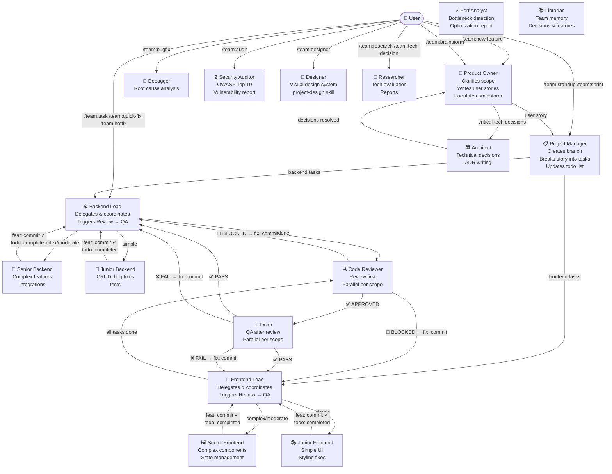

# OpenCode Agent Team

A production-ready multi-agent software development team for [OpenCode](https://opencode.ai). Drop it into any project and get a full team — product owner, project manager, tech leads, developers, QA, code reviewer, designer, security auditor, performance analyst, and librarian — all coordinated through a strict delegation chain with parallel execution, git integration, and a live todo board.

---

## How It Works



### Execution Phases

Every `/team:new-feature` flows through these phases — no phase starts before the previous is complete:

| Phase | Who | What happens |
|---|---|---|
| **1 — Planning** | product-owner → architect → project-manager | Scope clarified, tech decisions made, story written, branch created, tasks added to todo board |
| **2 — Implementation** | leads → senior/junior developers | Tasks delegated in parallel, each developer commits with `feat:` and marks task `completed` |
| **3 — Review** | leads → reviewers (parallel per scope) | Code reviewed first — structural issues caught before tests run |
| **4 — QA** | leads → testers (parallel per scope) | Tests run only after review passes — `fix:` commits for failures, re-test until all pass |

> **Why review before test?** Reviewers can reject architectural decisions that would make tests obsolete. Running tests on code that gets rejected wastes time and creates conflicting fix commits.

---

## Agents

The team has **17 agents**. Each agent has a specific role and a strict boundary — leads never write code, developers never skip the lead.

Agents marked with 🔒 are **hidden** — they don't appear in `@` autocomplete and are only invoked by other agents via the Task tool.

| Agent | Role | Mode |
|---|---|---|
| `product-owner` | Clarifies scope, writes user stories, owns the backlog, facilitates brainstorm sessions | primary |
| `project-manager` | Creates branches, breaks stories into tasks, coordinates leads | primary |
| `architect` | Technical decisions, ADR writing, infrastructure design | primary |
| `backend-lead` | Delegates backend tasks, owns review → QA for backend | primary |
| `frontend-lead` | Delegates frontend tasks, owns review → QA for frontend | primary |
| `designer` | Establishes visual design system, writes `project-design` skill | primary |
| `senior-backend` 🔒 | Complex backend features, integrations, performance | subagent |
| `junior-backend` 🔒 | CRUD, bug fixes, test writing | subagent |
| `senior-frontend` 🔒 | Complex components, state management, SSR | subagent |
| `junior-frontend` 🔒 | Simple UI, styling fixes, component tests | subagent |
| `tester` 🔒 | QA per scope — spawned in parallel by leads after review passes | subagent |
| `code-reviewer` 🔒 | Review per scope — spawned in parallel by leads before QA | subagent |
| `debugger` 🔒 | Root cause analysis for bugs and production incidents | subagent |
| `researcher` | Technology research, library comparison, spike reports | subagent |
| `security-auditor` 🔒 | OWASP Top 10, auth flaws, injection vulnerabilities — deeper than code-reviewer | subagent |
| `performance-analyst` 🔒 | N+1 queries, missing indexes, bundle size, cache opportunities | subagent |
| `librarian` 🔒 | Team memory manager — writes/retrieves decisions, features, bugs, research, debt | subagent |

### Recommended Models

| Agent | Tier | Why |
|---|---|---|
| `product-owner` | Strong (vision-capable preferred) | May read wireframes/mockups |
| `project-manager` | Strong | Task decomposition, dependency analysis |
| `architect` | Strong — best available | Highest-stakes decisions in the chain |
| `backend-lead` | Strong | Code quality judgment, complexity assessment |
| `frontend-lead` | Fast | UI architecture, SSR awareness |
| `designer` | Strong | Design decisions are permanent and affect all frontend |
| `senior-backend` | Strong | Complex implementation |
| `senior-frontend` | Fast | Complex component work |
| `junior-backend` | Fast | Simple tasks, fast iteration |
| `junior-frontend` | Fast | Simple tasks, fast iteration |
| `tester` | Fast | Test writing and execution |
| `code-reviewer` | Fast | Review quality, security awareness |
| `debugger` | Strong — best available | Root cause analysis is reasoning-heavy |
| `researcher` | Fast (vision-capable preferred) | Reading docs, diagrams, papers |
| `security-auditor` | Strong | False negatives are costly — don't cut corners here |
| `performance-analyst` | Strong | Architectural pattern recognition needed |
| `librarian` | Fast | Structured read/write, no complex reasoning needed |

> **Cost tip:** Junior agents, tester, and code-reviewer handle high-volume, lower-stakes work — use your fastest model there. Reserve your best model for architect, leads, debugger, security-auditor, and performance-analyst.

---

## Commands

Commands are the entry points. Pick the one that matches the scope of your work.

### Setup

| Command | Use when |
|---|---|
| `/team:init` | **Start here.** Scans the project, auto-detects the stack, asks targeted questions for gaps, and writes `.opencode/skills/project-stack/SKILL.md` |
| `/team:designer <brief>` | Define the project's visual design system — creates `.opencode/skills/project-design/SKILL.md` that all frontend agents follow |

### Feature development

| Command | Use when |
|---|---|
| `/team:brainstorm <idea>` | **Explore an idea first.** product-owner and architect discuss the idea with you in conversation mode. When ready, say "develop" or "let's build this" to kick off the full pipeline using the conversation as context — no re-explaining needed. |
| `/team:new-feature <description>` | Full pipeline — scope → architect → implementation → review → QA |
| `/team:task <description>` | Single well-defined task — skips planning, goes directly to the right developer |
| `/team:quick-fix <description>` | 1–3 file correction, no new logic — no todo list, just fix + review |
| `/team:tweak <description>` | Single file / single function change — skips leads, goes directly to the right developer |

### Bug handling

| Command | Use when |
|---|---|
| `/team:bugfix <description>` | Debugger finds root cause, lead coordinates fix, tester verifies |
| `/team:hotfix <description>` | Production is broken — hotfix branch, debugger triage, fast-track review |

### Code quality & analysis

| Command | Use when |
|---|---|
| `/team:audit [scope]` | Full project audit — security, performance, and code quality in parallel |
| `/team:refactor <description>` | Improve code structure without changing behavior — tests run before and after |
| `/team:add-test <description>` | Add tests to code that lacks coverage — no production code changes |
| `/team:review <file or area>` | Manually trigger a code review |

### Research & decisions

| Command | Use when |
|---|---|
| `/team:research <topic>` | Technology research — comparison report with recommendation |
| `/team:tech-decision <question>` | Architectural decision — researcher investigates, architect writes ADR |

### Planning & tracking

| Command | Use when |
|---|---|
| `/team:sprint <stories>` | Plan a sprint from user stories — task breakdown assigned to leads |
| `/team:standup` | Daily status — reads todo board and git log |

### Memory

| Command | Use when |
|---|---|
| `/team:remember <description>` | Manually save something to team memory — decisions, notes, context |
| `/team:recall <topic>` | Search team memory by topic — retrieves relevant past records |

### Maintenance

| Command | Use when |
|---|---|
| `/team:update-docs <description>` | Update README, API docs, architecture docs, or inline comments |

---

## Brainstorm Flow

`/team:brainstorm` is the recommended starting point when an idea is not yet fully formed.

```
/team:brainstorm <rough idea>
        ↓
product-owner + architect discuss with you
  — ask clarifying questions
  — present options and trade-offs
  — explore technical feasibility
        ↓
You say "develop" / "let's build this"
        ↓
product-owner summarizes decisions → you confirm
        ↓
project-manager picks up the summary
  — creates branch
  — breaks into tasks (no re-explaining needed)
  — assigns to leads
        ↓
Normal pipeline: implementation → review → QA
```

Use `/team:new-feature` instead when the idea is already well-defined and you know exactly what you want.

---

## Critical Decision Protocol

Four agents will stop and ask you before proceeding when they encounter a decision with long-term consequences. They always come with a recommendation — you never get a bare question.

| Agent | Asks about |
|---|---|
| `product-owner` | Ambiguous scope, user types, edge cases that change the whole design |
| `architect` | Protocol/transport choice (e.g. WebSocket vs SSE), infra topology, storage strategy, third-party selection |
| `backend-lead` | Package selection with compatibility concerns, database design trade-offs, queue vs sync |
| `frontend-lead` | State management approach, SSR trade-offs, new UI library adoption |

---

## Project Skills

The team uses three project-specific skills. All are generated automatically — you never write them by hand.

| Skill | Generated by | Purpose |
|---|---|---|
| `project-stack` | `/team:init` | Stack, test commands, folder structure, runtime constraints |
| `project-design` | `/team:designer` | Colors, typography, spacing, component patterns — loaded by all frontend agents |

---

## Configuration — opencode.json

The `.opencode/opencode.json` file is the control panel of the team. Without it, no agent runs.

### Key fields per agent

```json
"backend-lead": {
  "model": "my-provider/my-model",
  "mode": "all",           // all | primary | subagent
  "steps": 100,            // max tool calls — omit for unlimited
  "hidden": false,         // true = hidden from @ autocomplete
  "color": "#34d399",      // TUI color (hex in quotes, or theme name)
  "tools": {
    "todowrite": true,
    "todoread": true
  },
  "permission": {
    "bash": "allow",       // allow | ask | deny
    "edit": "allow"
  }
}
```

**`steps`** prevents runaway loops. Recommended values: leads 100, senior devs 80, junior devs 40, tester/reviewer 60, planning agents 80. Omit for unlimited.

**`permission`** controls what a subagent can do without asking you. Senior devs: `bash: allow`. Junior devs: `bash: ask`. Reviewers/debugger: no write access.

**`todowrite` / `todoread`** are disabled for subagents by default in OpenCode — the config explicitly enables them for agents that need the todo board.

**`color`** must be a hex value in single quotes (`'#34d399'`) or a theme name (`primary`, `accent`, etc.). Without quotes, YAML treats `#` as a comment.

### MCP servers

```json
"mcp": {
  "playwright": {
    "type": "local",
    "command": ["npx", "@playwright/mcp@latest"],
    "enabled": true
  }
}
```

---

## Installation

Node.js 18+ required (already installed if you have OpenCode).

```bash
node install.mjs
# or
npm run install-team
```

The script will:
1. Ask: **project** (`.opencode/` in current dir) or **global** (`~/.config/opencode/`)
2. Fetch available models via `opencode models`
3. Assign a **strong model** and a **fast model** across the team
4. Optionally customize models per individual agent
5. Copy all agent, command, and skill files
6. Generate or merge `opencode.json` — global installs only update the `agent` block, preserving your provider and MCP settings
7. Create `AGENTS.md` for project installs

## Updating

When a new version is released, run:

```bash
node update.mjs
# or
npm run update-team
```

To preview what will change without writing any files:

```bash
node update.mjs --dry-run
# or
npm run update-team:dry
```

The update script reads your current model assignments before overwriting anything and restores them after copying new files. It also shows a changelog of what changed since your last update.

---

## Folder Structure

```
.opencode/
├── opencode.json              ← providers, model assignments, tool permissions
├── agents/                    ← 17 agent prompt files
│   ├── product-owner.md
│   ├── project-manager.md
│   ├── architect.md
│   ├── designer.md
│   ├── backend-lead.md
│   ├── frontend-lead.md
│   ├── senior-backend.md      ← hidden
│   ├── junior-backend.md      ← hidden
│   ├── senior-frontend.md     ← hidden
│   ├── junior-frontend.md     ← hidden
│   ├── tester.md              ← hidden
│   ├── code-reviewer.md       ← hidden
│   ├── debugger.md            ← hidden
│   ├── researcher.md
│   ├── security-auditor.md    ← hidden
│   ├── performance-analyst.md ← hidden
│   └── librarian.md           ← hidden
├── commands/                  ← 20 command files
│   ├── team:init.md
│   ├── team:designer.md
│   ├── team:brainstorm.md
│   ├── team:new-feature.md
│   ├── team:task.md
│   ├── team:quick-fix.md
│   ├── team:tweak.md
│   ├── team:bugfix.md
│   ├── team:hotfix.md
│   ├── team:refactor.md
│   ├── team:add-test.md
│   ├── team:audit.md
│   ├── team:review.md
│   ├── team:research.md
│   ├── team:tech-decision.md
│   ├── team:sprint.md
│   ├── team:standup.md
│   ├── team:remember.md
│   ├── team:recall.md
│   └── team:update-docs.md
└── skills/
    ├── project-stack/         ← YOU CREATE THIS via /team:init
    │   └── SKILL.md
    ├── project-design/        ← YOU CREATE THIS via /team:designer
    │   └── SKILL.md
    ├── project-stack-template/
    │   └── SKILL.md           ← template to fill in manually if needed
    ├── workflow/
    │   └── SKILL.md           ← delegation chain, invocation templates
    ├── coding-standards/
    │   └── SKILL.md           ← quality rules, DoD, review severity levels
    └── git-workflow/
        └── SKILL.md           ← conventional commits, branch strategy

.memory/                       ← team memory (committed to git)
├── index.md                   ← master index of all records
├── decisions/
├── features/
├── bugs/
├── research/
└── debt/

examples/
└── laravel-octane-inertia/
    └── project-stack/
        └── SKILL.md           ← ready-made for Laravel 12 + Octane + Inertia SSR
```

---

## Git Integration

Every task produces a commit. No exceptions.

| Commit type | When |
|---|---|
| `feat(<scope>): ... [T0X]` | Implementation complete |
| `fix(<scope>): ... [T0X]` | QA failure or review finding fixed |
| `refactor(<scope>): ...` | Refactor complete |
| `test(<scope>): ...` | Tests added |
| `docs(<scope>): ...` | Documentation updated |

The task ID in every commit (e.g. `[T03]`) links git history to the todo board.

Feature branches are created by `project-manager` at story start: `feature/<story-slug>`.

---

## Contributing

PRs welcome. If you've built a `project-stack` skill for a different stack (Next.js, NestJS, Django, Rails, Go, etc.), add it under `examples/` and open a PR — currently only a Laravel example exists.

When modifying agent prompts, keep these invariants:
- Delegation chain must remain strict — no step can be skipped
- Review must run before QA — this order prevents wasted test work
- Critical Decision Protocol must remain in the four designated agents
- Todo board and git commit steps must remain mandatory for developers
- Parallel execution rules must remain — independent tasks always run in parallel
