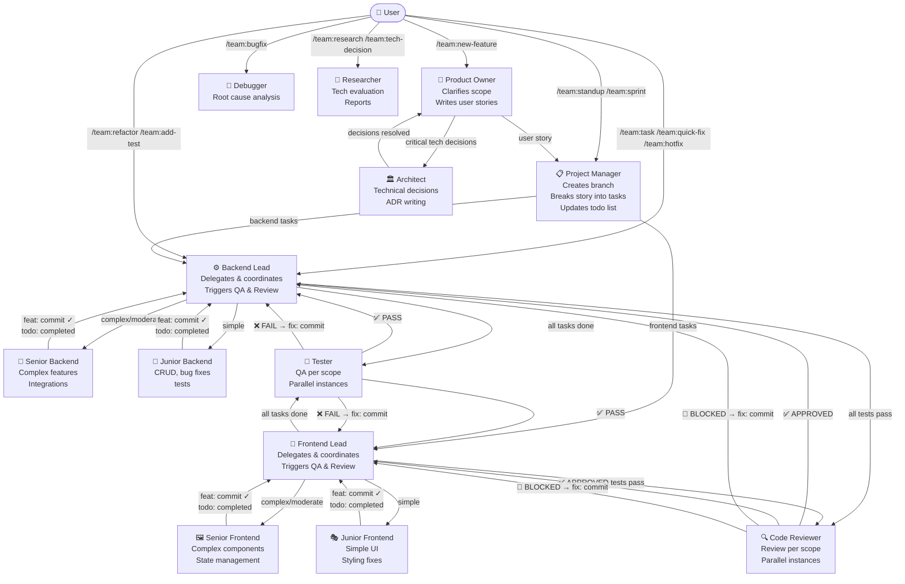

# OpenCode Agent Team

A production-ready multi-agent software development team for [OpenCode](https://opencode.ai). Drop it into any project and get a full team — product owner, project manager, tech leads, developers, QA, and code reviewer — all coordinated through a strict delegation chain with parallel execution, git integration, and a live todo board.

---

## How It Works



### Execution Phases

Every `/team:new-feature` flows through three strict phases — no phase starts before the previous is complete:

| Phase | Who | What happens |
|---|---|---|
| **1 — Planning** | product-owner → architect → project-manager | Scope is clarified, critical tech decisions are made, story is written, branch is created, tasks are added to the todo board |
| **2 — Implementation** | leads → senior/junior developers | Tasks are delegated in parallel, each developer commits with `feat:` and marks their task `completed` |
| **3 — QA** | leads → testers (parallel per scope) | Testers verify acceptance criteria, `fix:` commits for failures, re-test until all pass |
| **4 — Review** | leads → reviewers (parallel per scope) | Code reviewed per scope, `fix:` commits for findings, approved scopes stay approved |

---

## Agents

The team has 13 agents. Each agent has a specific role and a strict boundary — leads never write code, developers never skip the lead, and so on.

| Agent | Role | Mode |
|---|---|---|
| `product-owner` | Clarifies scope, writes user stories, owns the backlog | primary |
| `project-manager` | Creates branches, breaks stories into tasks, coordinates leads | primary |
| `architect` | Technical decisions, ADR writing, infrastructure design | primary |
| `backend-lead` | Delegates backend tasks, owns QA and review for backend | primary |
| `frontend-lead` | Delegates frontend tasks, owns QA and review for frontend | primary |
| `senior-backend` | Complex backend features, integrations, performance | subagent |
| `junior-backend` | CRUD, bug fixes, test writing | subagent |
| `senior-frontend` | Complex components, state management, SSR | subagent |
| `junior-frontend` | Simple UI, styling fixes, component tests | subagent |
| `tester` | QA per scope — spawned in parallel by leads | subagent |
| `code-reviewer` | Review per scope — spawned in parallel by leads | subagent |
| `debugger` | Root cause analysis for bugs and production incidents | subagent |
| `researcher` | Technology research, library comparison, spike reports | subagent |

### Recommended Models

These are recommendations based on the [OpenCode Arena](https://opencode.ai/arena) benchmarks. Any model supported by your provider will work — swap freely.

| Agent | Recommended Model | Why |
|---|---|---|
| `product-owner` | `qwen3.5-plus` or any vision-capable model | Reading wireframes/mockups from the user |
| `project-manager` | `glm-5` or a strong reasoning model | Task decomposition, dependency analysis |
| `architect` | `glm-5` or best available reasoning model | Highest-stakes decisions in the chain |
| `backend-lead` | `glm-5` or strong code model | Code quality judgment, complexity assessment |
| `frontend-lead` | `glm-4.7` or strong code model | UI architecture, SSR awareness |
| `senior-backend` | `glm-5` or strong code model | Complex implementation |
| `junior-backend` | `glm-4.7` or fast capable model | Simple tasks, fast iteration |
| `senior-frontend` | `glm-4.7` or strong code model | Complex component work |
| `junior-frontend` | `glm-4.7` or fast capable model | Simple tasks, fast iteration |
| `tester` | Any vision-capable model | Reading screenshots for UI test failures |
| `code-reviewer` | `glm-4.7` or strong code model | Review quality, security awareness |
| `debugger` | `glm-5` or best available reasoning model | Root cause analysis is reasoning-heavy |
| `researcher` | Any vision-capable model | Reading docs, diagrams, papers |

> **Cost tip:** Junior agents and code-reviewer handle high-volume, lower-stakes work. Assign your fastest/cheapest capable model there. Reserve your best model for architect, backend-lead, and debugger — they make the decisions that cascade through the rest of the chain.

---

## Commands

Commands are the entry points. Pick the one that matches the scope of your work.

### Feature development

| Command | Use when |
|---|---|
| `/team:new-feature <description>` | Starting a new feature from scratch — runs the full chain: scope clarification → architect decisions → story → implementation → QA → review |
| `/team:task <description>` | You know exactly what needs to be done and want it built immediately — skips planning, goes directly to the right developer |
| `/team:quick-fix <description>` | 1–3 file change, no new logic, under 30 minutes — no todo list, no QA, just fix + review |

### Bug handling

| Command | Use when |
|---|---|
| `/team:bugfix <description>` | A bug needs investigation — debugger finds root cause, lead coordinates fix, tester verifies |
| `/team:hotfix <description>` | Production is broken and can't wait — creates hotfix branch, debugger triages, senior developer fixes, fast-tracks review |

### Code quality

| Command | Use when |
|---|---|
| `/team:refactor <description>` | Improving code structure without changing behavior — runs tests before and after to confirm no regression |
| `/team:add-test <description>` | Adding tests to code that lacks coverage — no production code changes |
| `/team:review <file or area>` | Manually triggering a code review on specific files or an area |

### Research & decisions

| Command | Use when |
|---|---|
| `/team:research <topic>` | Researching a technology, library, or pattern — produces a comparison report with a recommendation |
| `/team:tech-decision <question>` | Evaluating an architectural decision — researcher investigates, architect writes an ADR |

### Planning & tracking

| Command | Use when |
|---|---|
| `/team:sprint <stories>` | Planning a sprint from a list of user stories — full task breakdown assigned to leads |
| `/team:standup` | Daily status report — reads the todo board and git log, outputs what's done / in progress / blocked |

### Setup

| Command | Use when |
|---|---|
| `/team:init` | **Start here.** Scans the project, auto-detects the stack, asks targeted questions for gaps, and writes `.agents/skills/project-stack/SKILL.md` — the file that makes every other agent project-aware |

### Maintenance

| Command | Use when |
|---|---|
| `/team:update-docs <description>` | Updating README, API docs, architecture docs, or inline comments |

---

## Critical Decision Protocol

Four agents will stop and ask you before proceeding when they encounter a decision with long-term consequences. They always come with a recommendation — you never get a bare question.

| Agent | Asks about |
|---|---|
| `product-owner` | Ambiguous scope, user types, edge cases that change the whole design |
| `architect` | Protocol/transport choice (e.g. WebSocket vs SSE), infra topology, storage strategy, third-party selection |
| `backend-lead` | Package selection with compatibility concerns, database design trade-offs, queue vs sync |
| `frontend-lead` | State management approach, SSR trade-offs, new UI library adoption |

Example — you type `/team:new-feature live chat`:

> **Decision Required: Real-time transport**
>
> **Option A — WebSocket:** True bidirectional, native support in most frameworks. Requires a persistent connection server.
> **Option B — SSE:** Server-to-client only, works over HTTP/2, simpler infrastructure. Not suitable for bidirectional chat.
> **Option C — Long Polling:** Simplest setup, highest latency and server load.
>
> **My recommendation: Option A (WebSocket)** — chat requires bidirectional communication; SSE cannot satisfy this.
>
> A) WebSocket  B) SSE  C) Long Polling  — or say "proceed" to go with my recommendation.

---

## Project Stack Skill — Required Setup

**Each project needs its own `project-stack` skill.** This is the only file that makes the team project-specific. Without it, agents won't know your test commands, folder structure, runtime constraints, or naming conventions.

### Setup

1. Copy `.opencode/skills/project-stack-template/SKILL.md` to `.agents/skills/project-stack/SKILL.md`
2. Fill in every section for your project
3. Delete the template notice at the top

The template covers: stack overview, project structure, test & build commands, critical runtime constraints, architecture patterns, naming conventions, and external services.

### Example

This repo includes a ready-made stack skill for **Laravel 12 + Octane/Swoole + Inertia SSR + Vue 3** in [`examples/laravel-octane-inertia/project-stack/SKILL.md`](examples/laravel-octane-inertia/project-stack/SKILL.md).

It covers Octane-specific pitfalls (static state bleeding between requests, ClickHouse write rules) and Inertia SSR rules (no `window`/`document` outside `onMounted`).

---

## Configuration — opencode.json

The `.opencode/opencode.json` file is the control panel of the team. Without it, no agent runs. It defines three things:

### 1. Providers

Tell OpenCode which AI providers to use and how to reach them:

```json
"provider": {
  "my-provider": {
    "name": "My Provider",
    "npm": "@ai-sdk/openai",
    "api": "https://api.my-provider.com/v1",
    "env": ["MY_PROVIDER_API_KEY"],
    "models": {
      "my-model": {
        "name": "My Model",
        "reasoning": true,
        "tool_call": true,
        "modalities": { "input": ["text"], "output": ["text"] },
        "limit": { "context": 128000, "output": 16384 },
        "cost": { "input": 0, "output": 0 }
      }
    }
  }
}
```

You can define multiple providers and mix models across agents. The included `opencode.json` uses placeholder provider names — replace them with your own. See [OpenCode provider docs](https://opencode.ai/docs/providers) for all supported providers.

### 2. Agent configuration

Each agent gets its own config block. The key fields:

```json
"backend-lead": {
  "model": "my-provider/my-model",   // which model runs this agent
  "temperature": 0.3,                 // lower = more deterministic
  "steps": 20,                        // max tool calls before stopping
  "tools": {                          // which tools are available
    "bash": true,
    "write": true,
    "edit": true,
    "read": true,
    "todowrite": true,
    "todoread": true
  },
  "task_permissions": {               // permission level when running as subagent
    "bash": "allow",                  // allow | ask | deny
    "write": "allow",
    "edit": "allow"
  }
}
```

**`steps`** is important — it prevents runaway loops. Recommended values:
- Planning agents (product-owner, PM): 10–15
- Lead agents: 20
- Senior developers: 40 (complex tasks need more steps)
- Junior developers: 20
- Testers / reviewers: 20–30

**`task_permissions`** controls what a subagent can do without asking you:
- Senior developers: `bash: allow` — they can run tests freely
- Junior developers: `bash: ask` — bash commands need your approval
- Reviewers / debugger: `write: false` — read-only, cannot modify files

**`todowrite` / `todoread`** are disabled for subagents by default in OpenCode. They must be explicitly enabled per agent in the tools block — the included config already does this.

### 3. MCP servers (optional)

Add any MCP integrations in the `mcp` block. Common ones:

```json
"mcp": {
  "playwright": {
    "type": "local",
    "command": ["npx", "@playwright/mcp@latest"],
    "enabled": true
  },
  "context7": {
    "type": "remote",
    "url": "https://mcp.context7.com/mcp",
    "enabled": true
  }
}
```

### Swapping models

To use a different model for an agent, change the `model` field. The format is always `"provider-name/model-name"` matching what you defined in the `provider` block.

```json
// Use a stronger model for architect
"architect": {
  "model": "my-provider/my-best-model",
  ...
}
```

---

## Installation

The easiest way is to run the setup script. Node.js 18+ is required (already installed if you have OpenCode).

```bash
node install.mjs
```

Or via npm:

```bash
npm run install-team
```

The script will:
1. Ask whether to install **project-specific** (`.opencode/` in current dir) or **global** (`~/.config/opencode/`)
2. Fetch your available models via `opencode models`
3. Ask you to assign a **strong model** (leads, architect, senior devs) and a **fast model** (juniors, tester, reviewer)
4. Optionally let you customize models per individual agent
5. Write all agent, command, and skill files
6. Generate or merge `opencode.json` with your model assignments (global installs only update the `agent` block — provider and MCP settings are preserved)
7. Create `AGENTS.md` and link it (project installs only)

### Manual installation

```bash
# 1. Copy the .opencode folder into your project root
cp -r opencode-agent-team/.opencode /your-project/.opencode
```

```bash
# 2. Edit opencode.json — set your providers and models
#    Replace "my-provider" and "my-strong-model" / "my-fast-model"
#    with your actual provider and model names
nano .opencode/opencode.json
```

```bash
# 3. Set your API key as an environment variable
export MY_PROVIDER_API_KEY=sk-...
```

```bash
# 4. Run team:init inside OpenCode
/team:init
```

`team:init` will:
- Scan the project and write `.agents/skills/project-stack/SKILL.md`
- Create `AGENTS.md` in the project root with placeholder sections
- Add `"instructions": ["AGENTS.md"]` to `opencode.json`

```bash
# 5. Open AGENTS.md and fill in your project rules
# Examples:
#   - "Always respond to me in Turkish"
#   - "Run php and npm commands inside Docker"
#   - "Always ask before creating new migrations"
nano AGENTS.md
```

> **Manually creating the stack skill?**
> Copy `.opencode/skills/project-stack-template/SKILL.md` to `.agents/skills/project-stack/SKILL.md` and fill it in instead of running `/team:init`. Also create `AGENTS.md` manually and add `"instructions": ["AGENTS.md"]` to `opencode.json`.

---

## Folder Structure

```
.opencode/
├── opencode.json         ← providers, model assignments, tool permissions
├── agents/
│   ├── product-owner.md
│   ├── project-manager.md
│   ├── architect.md
│   ├── backend-lead.md
│   ├── frontend-lead.md
│   ├── senior-backend.md
│   ├── junior-backend.md
│   ├── senior-frontend.md
│   ├── junior-frontend.md
│   ├── tester.md
│   ├── code-reviewer.md
│   ├── debugger.md
│   └── researcher.md
├── commands/
│   ├── team:init.md          ← start here for every new project
│   ├── team:new-feature.md
│   ├── team:task.md
│   ├── team:quick-fix.md
│   ├── team:bugfix.md
│   ├── team:hotfix.md
│   ├── team:refactor.md
│   ├── team:add-test.md
│   ├── team:review.md
│   ├── team:research.md
│   ├── team:tech-decision.md
│   ├── team:sprint.md
│   ├── team:standup.md
│   └── team:update-docs.md
└── skills/
# project-stack lives in .agents/skills/, not here
    ├── project-stack-template/
    │   └── SKILL.md          ← copy to .agents/skills/project-stack/SKILL.md
    ├── project-stack-template/
    │   └── SKILL.md          ← copy and fill in
    ├── workflow/
    │   └── SKILL.md          ← delegation chain, invocation templates
    ├── coding-standards/
    │   └── SKILL.md          ← universal quality rules, DoD, review levels
    └── git-workflow/
        └── SKILL.md          ← conventional commits, branch strategy

examples/
└── laravel-octane-inertia/
    └── project-stack/
        └── SKILL.md          ← ready-made for Laravel 12 + Octane + Inertia SSR
```

---

## Git Integration

Every task produces a commit. No exceptions.

- **Implementation complete** → `feat(<scope>): <description> [<task-id>]`
- **QA failure fixed** → `fix(<scope>): <description> [<task-id>]`
- **Review finding fixed** → `fix(<scope>): <description> [<task-id>]`
- **Refactor** → `refactor(<scope>): <description>`
- **Tests added** → `test(<scope>): <description>`
- **Docs updated** → `docs(<scope>): <description>`

The task ID in every commit (e.g. `[T03]`) links the git history to the todo board. A `git log` shows exactly which commit belongs to which task.

Feature branches are created by `project-manager` at story start: `feature/<story-slug>`.

---

## Contributing

PRs welcome. If you've built a project-stack skill for a different stack (Next.js, NestJS, Django, Rails, Go, etc.), add it under `examples/` and open a PR.

When modifying agent prompts, keep these invariants:
- Delegation chain must remain strict — no step can be skipped
- Critical Decision Protocol must remain in the four designated agents
- Todo board and git commit steps must remain mandatory for developers
- Parallel execution rules must remain — independent tasks always run in parallel
