# OpenCode Agent Team

A production-ready multi-agent software development team for [OpenCode](https://opencode.ai). Drop it into any project and get a full team — project manager, tech leads, developers, QA, code reviewer, SEO/GEO auditor, designer, security auditor, performance analyst, and librarian — all coordinated through a **Kanban-driven pipeline** with explicit Task-tool handoffs, strict delegation, lead-owned delivery cycles, git integration, GitHub Actions, and persistent team memory.

---

## Installation

Requirements:

- Node.js 18+
- npm
- `opencode` installed and available in `PATH`

Install the CLI globally from GitHub:

```bash
npm install -g klc/opencode-team
```

Then install the team inside any project:

```bash
cd path/to/your-project
opencode-team install
```

The global CLI is only the installer/updater. Run `opencode-team install` from the project directory where you want `.opencode/`, `.kanban/`, and project rules to be created.

For local development or a cloned checkout:

```bash
npm run install-team
```

The installer will:

1. Ask: **project** (`.opencode/`) or **global** (`~/.config/opencode/`)
2. Fetch available models via `opencode models`
3. Ask for **Quick config** or **Detailed config**
4. Quick config asks for **strong**, **medium**, and **fast** models and assigns them by role tier
5. Detailed config asks for a model for every agent one by one
6. Ask whether to set up GitHub Actions

## Updating

First update the global CLI package from GitHub:

```bash
npm install -g klc/opencode-team
```

Then update the installation from the target project directory:

```bash
cd path/to/your-project
opencode-team update

# Preview without writing:
opencode-team update --dry-run
```

From a local checkout:

```bash
npm run update-team

# Preview without writing:
npm run update-team:dry
```

The update script preserves your model assignments, `opencode.json` provider settings, `.kanban/` task data, and `project-stack` skill.

---

## How It Works

```
/team:new-feature "User profile photo upload"
        ↓
@project-manager clarifies scope, writes story context, creates KAN-001 + branch
        ↓
KAN-002 (backend) → @backend-lead    ┐ parallel
KAN-003 (frontend) → @frontend-lead  ┘
        ↓
Lead delegates to developer
Lead creates isolated task worktree + task branch
        ↓
Developer implements in task worktree (TDD: RED→GREEN→REFACTOR)
Developer reports back to Lead with test output evidence
        ↓
Lead starts @code-reviewer in the same task worktree
[If Pages/ or Layouts/ changed] Lead also starts @seo-auditor (parallel)
[If security-sensitive] Lead also starts @security-auditor (parallel)
        ↓
ALL APPROVED → Lead calls @tester
CHANGES REQUIRED → Lead re-delegates to developer → back to review
        ↓
ALL PASS → Lead cherry-picks task commits into feature branch → verifies → marks done → reports to @project-manager
ANY FAIL → Lead re-delegates to developer → back to review → back to test
```

**The lead owns the entire cycle.** Developers, reviewers, testers, and the SEO auditor all report back to the lead. The lead is the single coordinator — it calls the next agent, updates Kanban, and decides what happens next.

Every developer task runs in its own OpenCode worktree and `task/<KAN-ID>-<slug>` branch. Review, audit, and QA happen in that same task worktree. Only after review and QA pass does the lead cherry-pick the approved commits into the shared `feature/<story-slug>` branch.

There is no automatic Kanban trigger. After creating or updating a task, the current agent must explicitly call the next allowed agent with the Task tool. The `permission.task` matrix enforces this chain.

---

## Agent Hierarchy

```mermaid
flowchart TD
    PM["project-manager<br/>scope, story, branch, subtasks"]

    PM -. "technical decision" .-> ARCH
    ARCH -. "research support" .-> RES["researcher<br/>technology evaluation"]

    PM --> BL["backend-lead<br/>backend delivery owner"]
    PM --> FL["frontend-lead<br/>frontend delivery owner"]
    PM -. "memory" .-> LIB["librarian<br/>team memory"]

    BL --> SB["senior-backend<br/>complex backend work"]
    BL --> JB["junior-backend<br/>simple backend work"]
    BL --> CRB["code-reviewer<br/>review before QA"]
    BL --> TB["tester<br/>acceptance verification"]
    BL -. "sensitive scope" .-> SECB["security-auditor<br/>security review"]
    BL -. "performance scope" .-> PERFB["performance-analyst<br/>bottleneck analysis"]
    BL -. "unclear root cause" .-> DBGB["debugger<br/>root cause analysis"]
    BL -. "completion report" .-> PM

    FL --> SF["senior-frontend<br/>complex frontend work"]
    FL --> JF["junior-frontend<br/>simple frontend work"]
    FL --> CRF["code-reviewer<br/>review before QA"]
    FL --> TF["tester<br/>acceptance verification"]
    FL -. "pages/layouts changed" .-> SEO["seo-auditor<br/>SEO/GEO review"]
    FL -. "sensitive scope" .-> SECF["security-auditor<br/>security review"]
    FL -. "performance scope" .-> PERFF["performance-analyst<br/>bottleneck analysis"]
    FL -. "unclear root cause" .-> DBGF["debugger<br/>root cause analysis"]
    FL -. "design system" .-> DES["designer<br/>project-design skill"]
    FL -. "completion report" .-> PM

    SB -. "memory" .-> LIB
    SF -. "memory" .-> LIB
    CRB -. "debt records" .-> LIB
    CRF -. "debt records" .-> LIB
    DBGB -. "bug record" .-> LIB
    DBGF -. "bug record" .-> LIB
    RES -. "research record" .-> LIB
    DES -. "design decision" .-> LIB
```



Solid arrows are normal delivery handoffs. Dashed arrows are conditional support calls or reporting paths allowed by `permission.task`.

---

## Agents (17)


| Agent                    | Role                                                                                                                | Mode     |
| ------------------------ | ------------------------------------------------------------------------------------------------------------------- | -------- |
| `project-manager`        | Clarifies scope, writes story context, creates branches, splits into subtasks, coordinates leads via Kanban         | primary  |
| `architect`              | Technical decisions, ADR writing, infrastructure design                                                             | primary  |
| `backend-lead`           | Owns full backend delivery cycle: delegate → review → test → done                                                | primary  |
| `frontend-lead`          | Owns full frontend delivery cycle: delegate → review → SEO audit → test → done                                  | primary  |
| `designer`               | Establishes visual design system, writes`project-design` skill                                                      | primary  |
| `senior-backend` 🔒      | Complex backend features; reports to backend-lead                                                                   | subagent |
| `junior-backend` 🔒      | CRUD, bug fixes, test writing; reports to backend-lead                                                              | subagent |
| `senior-frontend` 🔒     | Complex components, state management, SSR; reports to frontend-lead                                                 | subagent |
| `junior-frontend` 🔒     | Simple UI, styling fixes; reports to frontend-lead                                                                  | subagent |
| `tester` 🔒              | Runs tests, verifies acceptance criteria, reports findings to lead                                                  | subagent |
| `code-reviewer` 🔒       | Reviews code, reports findings to lead                                                                              | subagent |
| `seo-auditor` 🔒         | Technical SEO, GEO/AEO readiness, E-E-A-T, AI crawler access, SSR meta rendering; reports findings to frontend-lead | subagent |
| `debugger` 🔒            | Root cause analysis using systematic 4-phase process                                                                | subagent |
| `researcher`             | Technology research, library comparison, spike reports                                                              | subagent |
| `security-auditor` 🔒    | OWASP Top 10, invoked alongside code-reviewer for security-sensitive scopes                                         | subagent |
| `performance-analyst` 🔒 | N+1 queries, missing indexes, bundle size                                                                           | subagent |
| `librarian` 🔒           | Team memory manager — enriches records with Kanban history                                                         | subagent |

---

## Lead-Owned Delivery Cycle

The lead is the single coordinator for every task it owns. The full frontend cycle (including SEO):

```
PHASE 1 — Start isolated developer worktree
  Lead → worktree_start_task → developer session
  Developer: TDD cycle in task worktree (RED→GREEN→REFACTOR) → commit on task branch → report to lead

PHASE 2 — Lead reviews report
  If incomplete → send back to developer immediately
  If complete → proceed

PHASE 3a — SEO Scope Detection (frontend only)
  Lead checks task diff against the base feature branch
  Pages/ or Layouts/ changed → start @code-reviewer AND @seo-auditor in parallel in the task worktree
  Only Components/ changed → start @code-reviewer only (no SEO audit)

PHASE 3 — Code Review + SEO Audit (parallel when applicable)
  Lead → worktree_start_agent(@code-reviewer)
  Lead → worktree_start_agent(@seo-auditor, parallel — Pages/Layouts only)

PHASE 4 — After Reviews
  BOTH APPROVED → proceed to PHASE 5
  code-reviewer CHANGES REQUIRED → Lead reopens → re-delegates to developer
  seo-auditor   CHANGES REQUIRED → Lead reopens → re-delegates to developer

PHASE 5 — Testing
  Lead updates Kanban to "testing"
  Lead → worktree_start_agent(@tester)
  Tester runs full suite → verifies each acceptance criterion → reports to lead

PHASE 6 — After Testing
  ALL PASS → Lead cherry-picks task commits → verifies feature branch → marks done → reports to project-manager
  ANY FAIL → Lead reopens → re-delegates to developer → back to PHASE 3
```

---

## Skills Library

### Core Methodology Skills


| Skill                            | Used by                          | Purpose                                                                           |
| -------------------------------- | -------------------------------- | --------------------------------------------------------------------------------- |
| `test-driven-development`        | All developers                   | RED-GREEN-REFACTOR Iron Law. Writing code before tests → delete and restart.     |
| `systematic-debugging`           | debugger, tester                 | 4-phase root cause process. No fixes without completing Phase 1.                  |
| `verification-before-completion` | All developers, tester, reviewer | Run the command, read the output, then report. "Should work" is not verification. |
| `receiving-code-review`          | All developers                   | Verify before implementing, ask before assuming, one item at a time.              |

### Workflow Skills


| Skill                    | Used by                | Purpose                                                           |
| ------------------------ | ---------------------- | ----------------------------------------------------------------- |
| `workflow`               | leads, project-manager | Delegation chain, parallelization, context chain, memory protocol |
| `coding-standards`       | all agents             | Quality rules, Definition of Done, review severity levels         |
| `git-workflow`           | all developers         | Commit format, branch strategy, breaking changes                  |
| `project-stack`          | all agents             | Project-specific tech stack, commands, constraints                |
| `project-stack-template` | architect              | Template for creating the project-stack skill                     |

---

## Commands (23)

### Setup


| Command                        | Use when                                                                                                                                                             |
| ------------------------------ | -------------------------------------------------------------------------------------------------------------------------------------------------------------------- |
| `/team:scaffold <description>` | **Start here for new projects.** Architect gathers goals, recommends a stack when needed, then installs or prepares a setup guide.                                   |
| `/team:init`                   | **Start here for existing projects.** Scans the project, auto-detects the stack, writes `project-stack` skill. Redirects to `/team:scaffold` if the folder is empty. |
| `/team:designer <brief>`       | Define the project's visual design system.                                                                                                                           |

### Feature development


| Command                           | Use when                                                                                                                            |
| --------------------------------- | ----------------------------------------------------------------------------------------------------------------------------------- |
| `/team:brainstorm <idea>`         | Explore an idea first. project-manager facilitates and may invite architect for technical trade-offs. Say "develop" to kick off the full pipeline. |
| `/team:new-feature <description>` | Full Kanban-driven pipeline — project-manager clarifies scope, creates a feature task, writes story context, then routes to lead(s) |
| `/team:task <description>`        | Single well-defined task — project-manager routes to the right lead                                                                |
| `/team:quick-fix <description>`   | 1–3 file correction, no new logic; project-manager routes to the owning lead                                                       |
| `/team:tweak <description>`       | Single file / single function change; project-manager routes to the owning lead                                                     |

### Kanban board


| Entry point                       | Use when                                                      |
| --------------------------------- | ------------------------------------------------------------- |
| `npm run kanban-board`            | Launch the local web-based Kanban Board GUI                   |
| `kanban_list_tasks`               | See active tasks grouped by status from an agent/tool context |
| `kanban_get_task`                 | Read full details for a specific task, including history      |
| `/team:new-feature <description>` | Create a feature task and start the full pipeline             |

### Bug handling


| Command                      | Use when                                                                                                             |
| ---------------------------- | -------------------------------------------------------------------------------------------------------------------- |
| `/team:bugfix <description>` | Project-manager creates a tracked bug task and routes it to the lead; lead invokes debugger if root cause is unclear |
| `/team:hotfix <description>` | Production is broken — project-manager creates hotfix branch and routes to lead-owned fast-track review             |

### Code quality & analysis


| Command                         | Use when                                                                                                   |
| ------------------------------- | ---------------------------------------------------------------------------------------------------------- |
| `/team:audit [scope]`           | Full project audit — backend-lead invokes security, performance, and code-quality specialists in parallel |
| `/team:seo-audit [url or path]` | SEO/GEO audit — technical SEO (9 categories) + GEO readiness score (0-100). Supports live URL comparison. |
| `/team:refactor <description>`  | Improve code structure without changing behavior                                                           |
| `/team:add-test <description>`  | Add tests to code that lacks coverage                                                                      |
| `/team:review <file or area>`   | Manually trigger a code review                                                                             |

### Research & decisions


| Command                          | Use when                                                                                                 |
| -------------------------------- | -------------------------------------------------------------------------------------------------------- |
| `/team:research <topic>`         | Technology research — comparison report with recommendation                                             |
| `/team:tech-decision <question>` | Architectural decision — architect evaluates, optionally invokes researcher, and writes ADR when needed |

### Planning & tracking


| Command                  | Use when                                                                 |
| ------------------------ | ------------------------------------------------------------------------ |
| `/team:sprint <stories>` | Plan a sprint — surfaces Kanban board + debt backlog, breaks down tasks |
| `/team:standup`          | Daily status — reads Kanban board, git log, and high-priority debt      |

### Memory


| Command                        | Use when                                 |
| ------------------------------ | ---------------------------------------- |
| `/team:remember <description>` | Manually save something to team memory   |
| `/team:recall <topic>`         | Search team memory                       |
| `/team:resolve-debt <title>`   | Pick up and resolve a specific debt item |

### Maintenance


| Command                           | Use when                                                       |
| --------------------------------- | -------------------------------------------------------------- |
| `/team:update-docs <description>` | Update README, API docs, architecture docs, or inline comments |

---

## Getting Started

### New project (empty folder)

```bash
mkdir my-project && cd my-project
/team:scaffold
```

`/team:scaffold` will ask what you're building, help you choose a tech stack (or recommend one via @architect), and either install everything automatically or generate a `SETUP.md` guide.

### Existing project

```bash
cd my-existing-project
/team:init
```

`/team:init` scans your codebase, auto-detects the stack, and generates the `project-stack` skill. If the folder is empty it will redirect you to `/team:scaffold` automatically.

---

## Kanban System

### Status Flow

```
backlog → planning → in-progress → review → testing → done
                                      ↑          ↑
                                   reopened ←────┘ (on failure)
```


| Status        | Who sets it                                                   |
| ------------- | ------------------------------------------------------------- |
| `backlog`     | project-manager (on task creation)                            |
| `planning`    | project-manager (after story context is written)              |
| `in-progress` | project-manager or lead (when work starts)                    |
| `review`      | lead (after developer reports completion)                     |
| `testing`     | lead (after all invoked reviewers/auditors report APPROVED)   |
| `done`        | lead (after tester reports ALL PASS)                          |
| `reopened`    | lead (after reviewer, seo-auditor, or tester reports failure) |

### Custom Tools


| Tool                 | Used by                                  | What it does                     |
| -------------------- | ---------------------------------------- | -------------------------------- |
| `kanban_create_task` | project-manager                          | Create tracked tasks             |
| `kanban_update_task` | leads, project-manager                   | Update status and notes          |
| `kanban_get_task`    | all agents                               | Read full task context + history |
| `kanban_list_tasks`  | all agents                               | Board view with filters          |
| `memory_search`      | all agents                               | Semantic search over`.memory/`   |
| `complexity_score`   | code-reviewer,`/team:audit`              | Cyclomatic complexity analysis   |
| `debt_summary`       | project-manager, sprint/standup          | Prioritized debt backlog         |
| `stack_detect`       | architect,`/team:init`, `/team:scaffold` | Auto-detects project stack       |

---

## Security

### permission.task — Delegation chain at API level


| Agent                | Can invoke                                                                                                                                                                 |
| -------------------- | -------------------------------------------------------------------------------------------------------------------------------------------------------------------------- |
| `project-manager`    | backend-lead, frontend-lead, architect, librarian                                                                                                                          |
| `backend-lead`       | senior-backend, junior-backend, code-reviewer, tester, security-auditor, performance-analyst, debugger, researcher, project-manager, librarian                             |
| `frontend-lead`      | senior-frontend, junior-frontend, code-reviewer, tester, security-auditor,**seo-auditor**, performance-analyst, debugger, researcher, project-manager, librarian, designer |
| `senior/junior devs` | librarian only (or none for juniors)                                                                                                                                       |
| `code-reviewer`      | librarian                                                                                                                                                                  |
| `seo-auditor`        | none                                                                                                                                                                       |
| `tester`             | none                                                                                                                                                                       |

### Bash permissions per tier


| Tier       | Who                                                          | Rules                                                              |
| ---------- | ------------------------------------------------------------ | ------------------------------------------------------------------ |
| `lead`     | backend-lead, frontend-lead                                  | All allowed;`git push` requires approval                           |
| `senior`   | senior devs, tester                                          | All allowed; push/rebase/reset/rm-rf require approval; sudo denied |
| `junior`   | junior devs                                                  | Only safe ops; push/rebase/reset/rm-rf denied                      |
| `readonly` | code-reviewer, debugger,**seo-auditor**, auditors, librarian | Read + webfetch allowed; push and sudo denied                      |

---

## GitHub Actions


| Workflow                      | Trigger                   | What happens                    |
| ----------------------------- | ------------------------- | ------------------------------- |
| `opencode.yml`                | `/oc` comment on issue/PR | OpenCode executes the request   |
| `opencode-pr-review.yml`      | PR opened/synchronized    | Automatic code review           |
| `opencode-security-audit.yml` | Every Monday 09:00 UTC    | Full OWASP Top 10 scan          |
| `opencode-issue-triage.yml`   | New issue opened          | Classifies and labels the issue |

**Setup:** Add `ANTHROPIC_API_KEY` to GitHub → Settings → Secrets → Actions.

---

## Team Memory

```
.memory/
├── index.md          ← master index
├── decisions/        ← architectural decisions and ADRs
├── features/         ← completed feature summaries
├── bugs/             ← root cause analyses and fixes
├── research/         ← technology research reports
└── debt/             ← technical debt backlog
```

---

## Folder Structure

```
.opencode/
├── opencode.json
├── agents/                    ← 18 agent prompt files
├── commands/                  ← 23 command files
│   ├── team:scaffold.md       ← NEW: scaffold new projects from scratch
│   └── ...
├── plugins/
│   ├── kanban-trigger.ts
│   ├── graphify.js
│   └── worktree-manager.ts
├── skills/
│   ├── test-driven-development/SKILL.md
│   ├── systematic-debugging/SKILL.md
│   ├── verification-before-completion/SKILL.md
│   ├── receiving-code-review/SKILL.md
│   ├── workflow/SKILL.md
│   ├── git-workflow/SKILL.md
│   ├── coding-standards/SKILL.md
│   └── project-stack-template/SKILL.md
└── tools/
    ├── _kanban-core.ts
    ├── kanban-create-task.ts
    ├── kanban-update-task.ts
    ├── kanban-get-task.ts
    ├── kanban-list-tasks.ts
    ├── memory-search.ts
    ├── complexity-score.ts
    ├── debt-summary.ts
    └── stack-detect.ts

kanban-board/                  ← Visual Kanban Board App
.kanban/                       ← Kanban board state (commit to git)
.memory/                       ← Team memory (commit to git)
examples/
└── laravel-octane-inertia/
    └── project-stack/SKILL.md
```

---

## Contributing

PRs welcome. If you've built a `project-stack` skill for a different stack (Next.js, NestJS, Django, Rails, Go, etc.), add it under `examples/` and open a PR.

When modifying agent prompts, keep these invariants:

- Delegation chain must remain strict — no step can be skipped
- `permission.task` must match prompt rules
- **Leads own the full delivery cycle** — reviewers, seo-auditor, and testers report to the lead, never to Kanban directly
- Developers always report back to their lead — never to Kanban or to the reviewer
- SEO audit runs in **parallel** with code review — never sequentially (no added latency)
- SEO audit only triggers for **Pages/ and Layouts/ changes** — not every frontend commit
- Review must run before QA
- Parallel execution: backend + frontend run in parallel, each team is sequential internally
